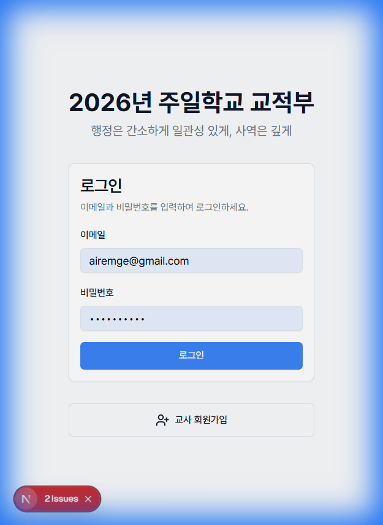
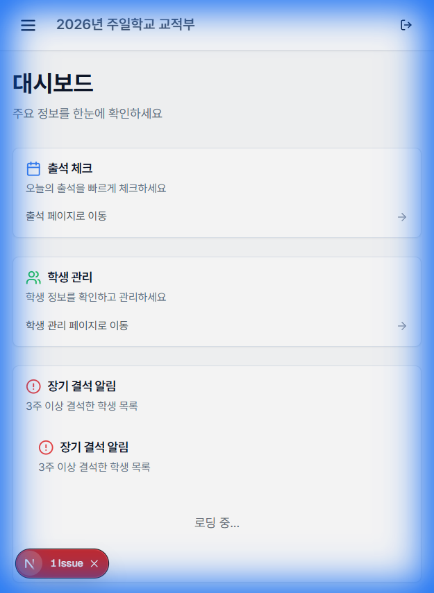
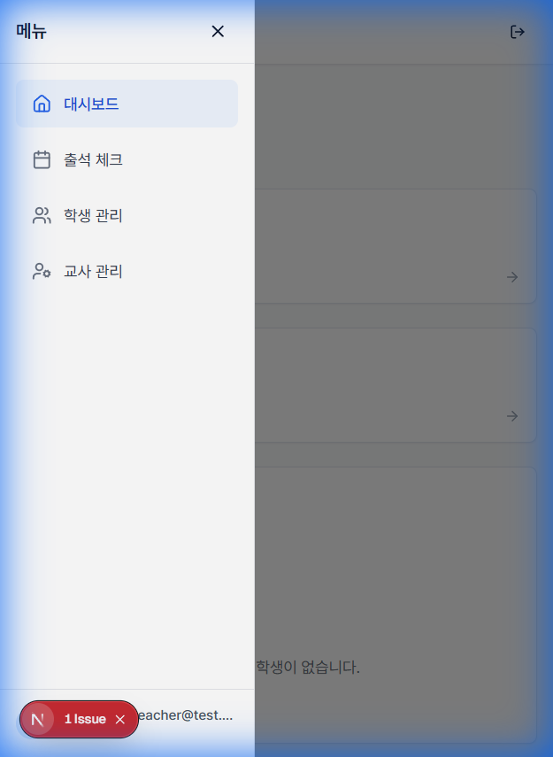
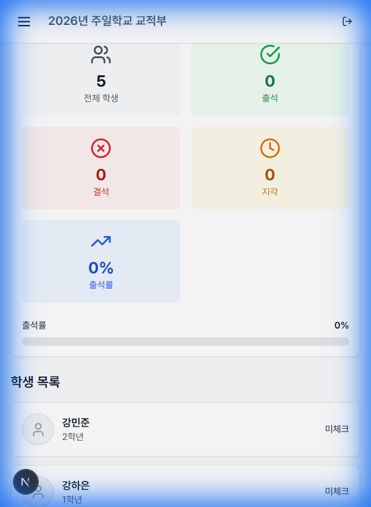
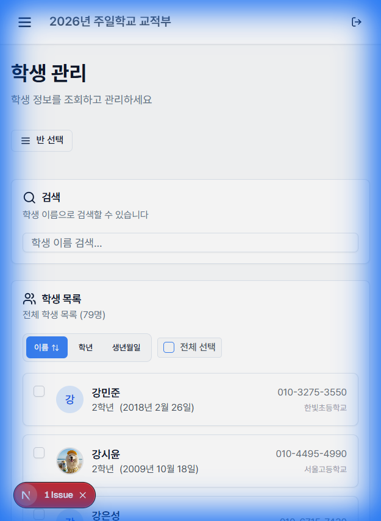
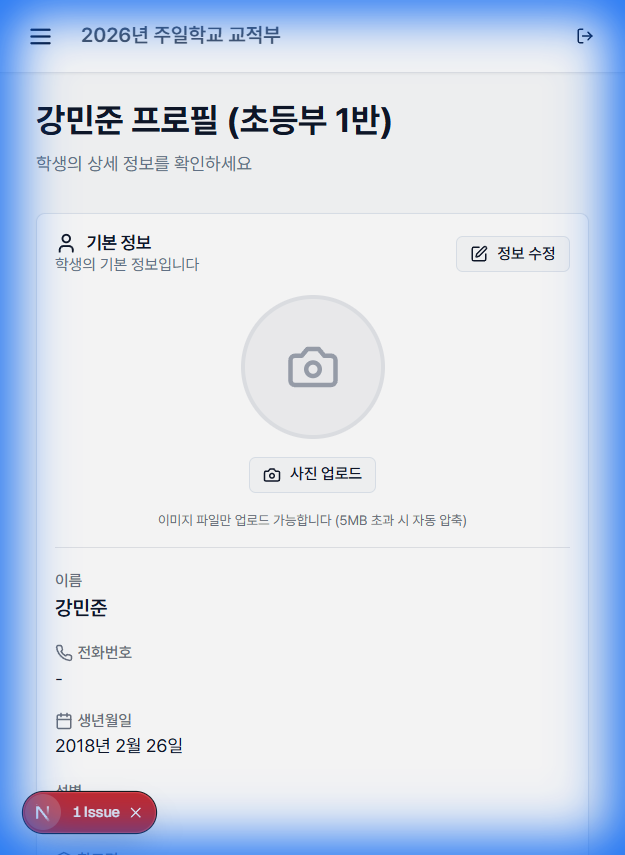
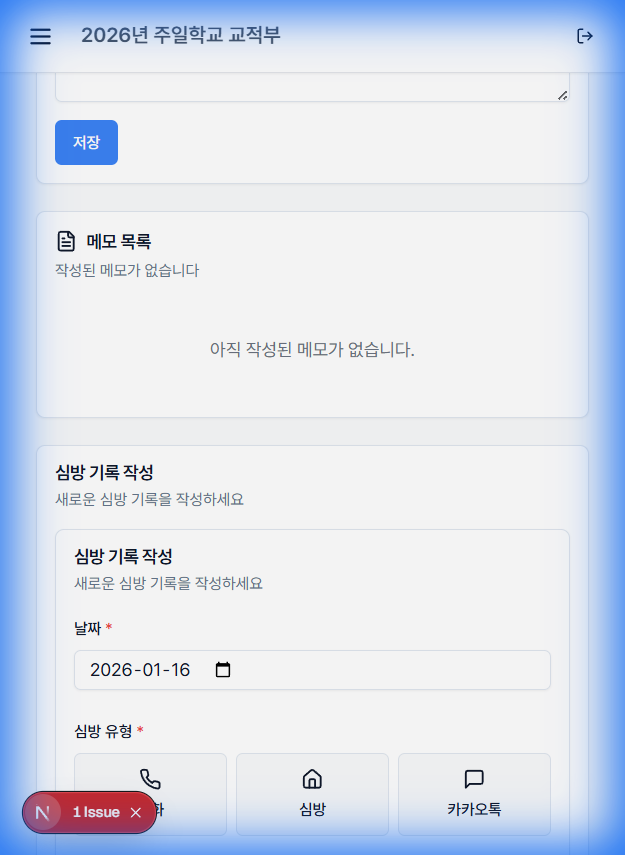

# 🍎 반 담임 교사 시스템 사용 가이드

**2026년 주일학교 교적부**에 오신 선생님들을 환영합니다!  
이 가이드는 **반을 담당하시는 담임 선생님**들이 시스템을 원활하게 사용하실 수 있도록 주요 기능을 설명합니다.

---

## 1. 시작하기

### 🔗 접속 및 로그인
1. 교적부 주소(URL)로 접속합니다.
2. **로그인** 화면에서 이메일과 비밀번호를 입력합니다.
   - 아직 계정이 없다면 하단의 `교사 회원가입`을 눌러 가입을 진행해주세요.
   - **참고:** 회원가입 후 관리자의 **승인**이 있어야 로그인이 가능합니다.

---

## 2. 대시보드 (메인 화면)

로그인 후 처음 보이는 화면입니다. 한 주간의 우리 주일학교 현황을 스마트폰에서도 한눈에 볼 수 있습니다.

- **주일학교 전체 통계 & 내 부서 통계:** 출석 및 결석 현황을 그래프로 확인합니다.
- **메뉴 열기:** 왼쪽 상단의 햄버거 버튼(☰)을 누르면 주요 메뉴로 이동할 수 있습니다.

  
  

---

## 3. ✅ 출석 체크 (가장 중요!)

매주 주일 공과 공부 시간에 스마트폰으로 간편하게 출석을 체크해 주세요.

1. 메뉴에서 **[출석부]**를 클릭합니다.
2. 선생님이 담당하신 **반 이름을 선택**하면 학생 명단이 나타납니다.
   - (여러 반을 담당하신 경우 상단에서 반을 선택할 수 있습니다.)
   - 명단이 보이지 않으면 상단의 '반 선택' 드롭다운을 눌러주세요.
3. 학생 이름 옆의 **상태 버튼**을 눌러 출석(🟢), 결석(🔴) 등을 기록합니다. (자동 저장)

---

## 4. 👦 학생 관리

우리 반 아이들의 정보를 확인하고 전화번호 등을 수정할 수 있습니다.

1. 메뉴에서 **[학생 관리]**를 클릭하여 학생 목록을 확인합니다.
2. 학생의 **이름을 터치**하면 상세 정보 팝업이 뜹니다.
3. 여기서 보호자 연락처 확인, 전화 걸기, 정보 수정이 가능합니다.

  
  

---

## 5. 📝 심방 기록 (메모)

학생 상세 화면의 아래쪽 **[심방 기록]** 탭에서 아이들과의 상담 내용이나 기도 제목을 기록할 수 있습니다.

---

**도움이 필요하신가요?**  
사용 중 궁금한 점이 있다면 언제든 관리자에게 문의해 주세요. 선생님의 헌신에 감사드립니다! 🙏
