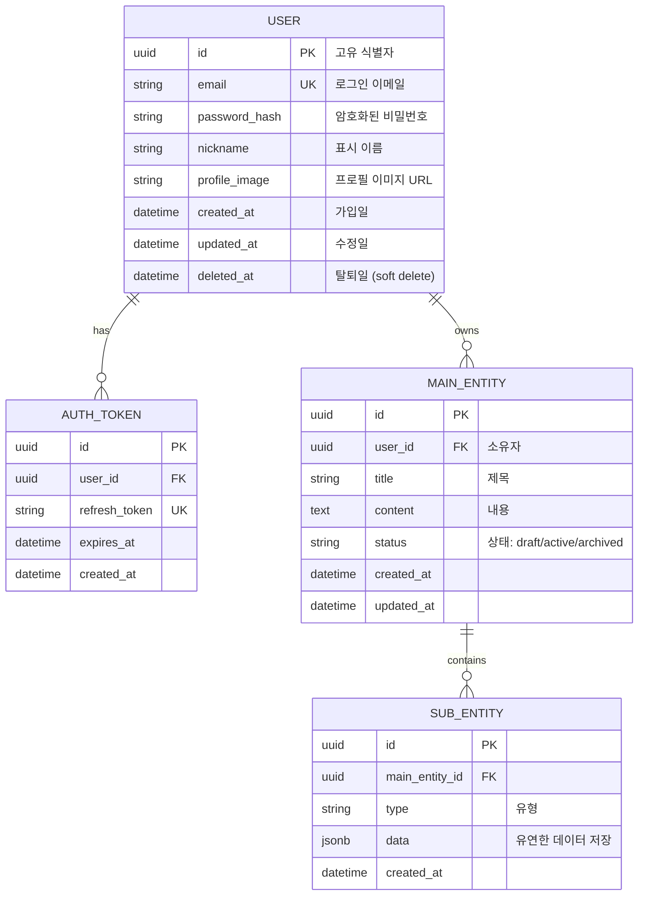
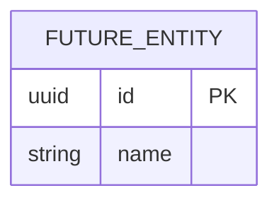

# Database Design (데이터베이스 설계) 템플릿

> Mermaid ERD로 주요 엔티티와 관계를 표현합니다.
> 각 엔티티에 FEAT 주석을 달아 어떤 기능에서 사용되는지 명시합니다.
> 최소 수집 원칙을 반영하여 불필요한 개인정보는 지양합니다.

---

## MVP 캡슐

| # | 항목 | 내용 |
|---|------|------|
| 1 | 목표 | {{목표}} |
| 2 | 페르소나 | {{페르소나}} |
| 3 | 핵심 기능 | {{FEAT-1: 핵심기능명}} |
| 4 | 성공 지표 (노스스타) | {{노스스타 지표}} |
| 5 | 입력 지표 | {{입력지표 1~2개}} |
| 6 | 비기능 요구 | {{최소 1개}} |
| 7 | Out-of-scope | {{이번엔 안 함}} |
| 8 | Top 리스크 | {{리스크 1개}} |
| 9 | 완화/실험 | {{완화책}} |
| 10 | 다음 단계 | {{바로 할 행동}} |

---

## 1. ERD (Entity Relationship Diagram)

---

## 2. 엔티티 상세 정의

### 2.1 USER (사용자) - FEAT-0

| 컬럼 | 타입 | 제약조건 | 설명 |
|------|------|----------|------|
| id | UUID | PK | 고유 식별자 |
| email | VARCHAR(255) | UNIQUE, NOT NULL | 로그인 이메일 |
| password_hash | VARCHAR(255) | NULL 허용 | 소셜 로그인 시 NULL |
| nickname | VARCHAR(50) | NOT NULL | 표시 이름 |
| profile_image | VARCHAR(500) | NULL | 프로필 이미지 URL |
| created_at | TIMESTAMP | NOT NULL, DEFAULT NOW() | 가입일 |
| updated_at | TIMESTAMP | NOT NULL | 최종 수정일 |
| deleted_at | TIMESTAMP | NULL | Soft delete용 |

**인덱스:**
- `idx_user_email` ON email

**최소 수집 원칙 적용:**
- 필수: email, nickname
- 선택: profile_image
- 수집 안 함: 전화번호, 주소, 생년월일 (필요 없음)

### 2.2 MAIN_ENTITY ({{핵심 엔티티명}}) - FEAT-1

| 컬럼 | 타입 | 제약조건 | 설명 |
|------|------|----------|------|
| id | UUID | PK | 고유 식별자 |
| user_id | UUID | FK → USER.id, NOT NULL | 소유자 |
| title | VARCHAR(200) | NOT NULL | 제목 |
| content | TEXT | NULL | 본문 내용 |
| status | VARCHAR(20) | NOT NULL, DEFAULT 'draft' | 상태 |
| created_at | TIMESTAMP | NOT NULL, DEFAULT NOW() | 생성일 |
| updated_at | TIMESTAMP | NOT NULL | 수정일 |

**인덱스:**
- `idx_main_user_id` ON user_id
- `idx_main_status` ON status
- `idx_main_created_at` ON created_at DESC

---

## 3. 관계 정의

| 부모 | 자식 | 관계 | 설명 |
|------|------|------|------|
| USER | AUTH_TOKEN | 1:N | 사용자는 여러 토큰 보유 가능 |
| USER | MAIN_ENTITY | 1:N | 사용자는 여러 {{엔티티}} 소유 |
| MAIN_ENTITY | SUB_ENTITY | 1:N | {{엔티티}}는 여러 하위 데이터 포함 |

---

## 4. 데이터 생명주기

| 엔티티 | 생성 시점 | 보존 기간 | 삭제/익명화 |
|--------|----------|----------|------------|
| USER | 회원가입 | 탈퇴 후 30일 | Hard delete |
| AUTH_TOKEN | 로그인 | 만료 시 | Hard delete |
| MAIN_ENTITY | 기능 사용 | 계정과 동일 | Cascade delete |
| SUB_ENTITY | 상위와 함께 | 상위와 동일 | Cascade delete |

---

## 5. 확장 고려사항

### 5.1 v2에서 추가 예정 엔티티

### 5.2 인덱스 전략

- **읽기 최적화**: 자주 조회되는 컬럼에 인덱스
- **쓰기 고려**: 인덱스 과다 방지
- **복합 인덱스**: 자주 함께 조회되는 컬럼 조합

---

## Decision Log 참조

{{대화 중 기록된 Decision Log 중 데이터 관련 항목}}

