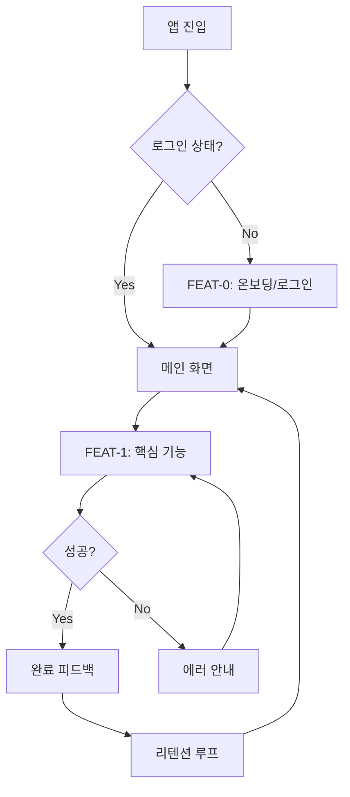
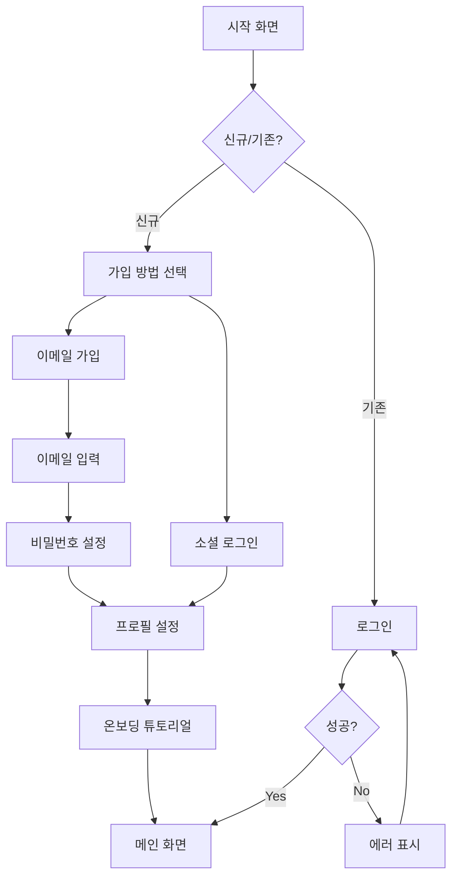
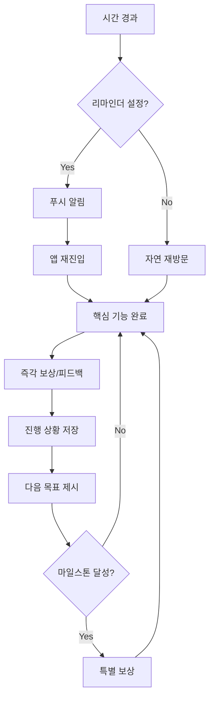
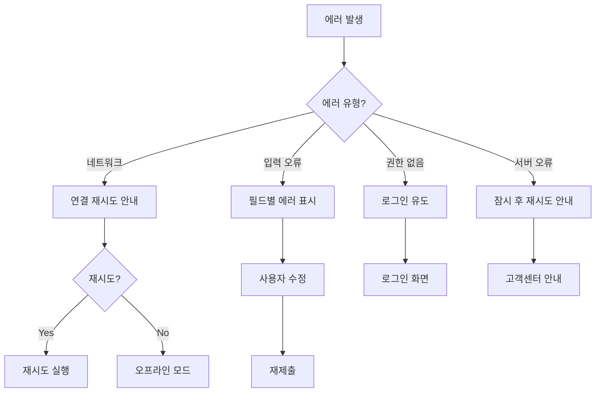

# User Flow (사용자 흐름도) 템플릿

> Mermaid 플로우차트로 핵심 기능의 주요 여정을 표현합니다.
> 성공/실패 분기를 포함하고, 온보딩→핵심작업→리텐션 루프를 표현합니다.

---

## MVP 캡슐

| # | 항목 | 내용 |
|---|------|------|
| 1 | 목표 | {{목표}} |
| 2 | 페르소나 | {{페르소나}} |
| 3 | 핵심 기능 | {{FEAT-1: 핵심기능명}} |
| 4 | 성공 지표 (노스스타) | {{노스스타 지표}} |
| 5 | 입력 지표 | {{입력지표 1~2개}} |
| 6 | 비기능 요구 | {{최소 1개}} |
| 7 | Out-of-scope | {{이번엔 안 함}} |
| 8 | Top 리스크 | {{리스크 1개}} |
| 9 | 완화/실험 | {{완화책}} |
| 10 | 다음 단계 | {{바로 할 행동}} |

---

## 1. 전체 사용자 여정 (Overview)



---

## 2. FEAT-0: 온보딩/로그인 플로우



---

## 3. FEAT-1: {{핵심 기능명}} 플로우

```mermaid
graph TD
    A[기능 진입] --> B[{{단계1}}]
    B --> C[{{단계2}}]
    C --> D{{{분기점}}?}

    D -->|옵션A| E[{{처리A}}]
    D -->|옵션B| F[{{처리B}}]

    E --> G[저장/제출]
    F --> G

    G --> H{성공?}
    H -->|Yes| I[성공 피드백]
    H -->|No| J[에러 안내]

    I --> K[다음 액션 유도]
    J --> B
```

---

## 4. 리텐션 루프 (습관 형성)



---

## 5. 에러 처리 플로우



---

## 6. 화면 목록 (Screen Inventory)

| 화면 ID | 화면명 | FEAT | 진입점 | 주요 액션 |
|---------|--------|------|--------|----------|
| S-01 | 시작 화면 | FEAT-0 | 앱 실행 | 로그인/가입 선택 |
| S-02 | 로그인 | FEAT-0 | S-01 | 이메일/소셜 로그인 |
| S-03 | 회원가입 | FEAT-0 | S-01 | 계정 생성 |
| S-04 | 메인 화면 | - | S-02, S-03 | 핵심 기능 진입 |
| S-05 | {{핵심 기능}} | FEAT-1 | S-04 | {{주요 액션}} |
| S-06 | 결과/피드백 | FEAT-1 | S-05 | 확인, 공유 |

---

## Decision Log 참조

{{대화 중 기록된 Decision Log 중 UX/플로우 관련 항목}}

