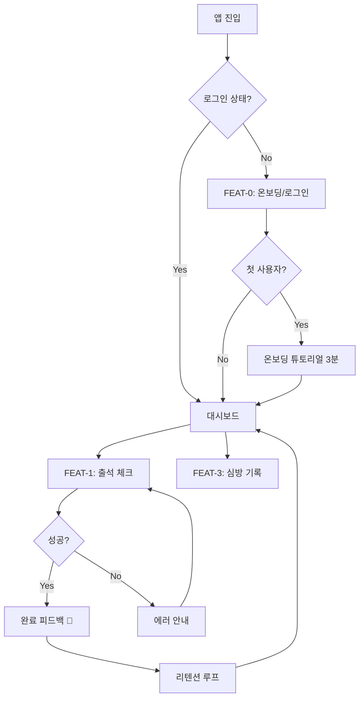
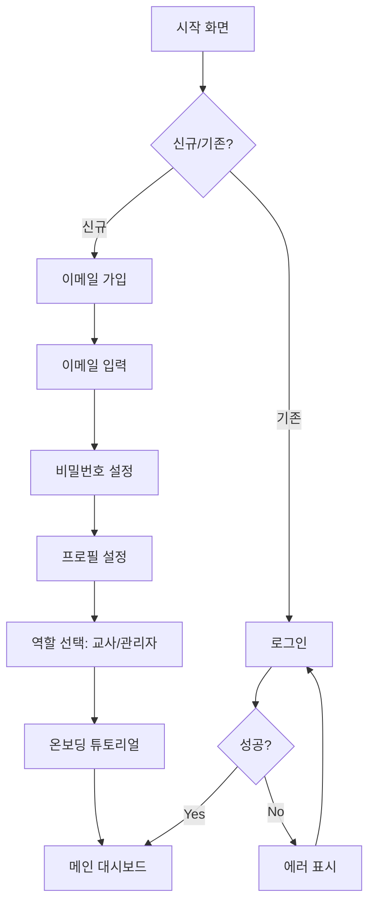
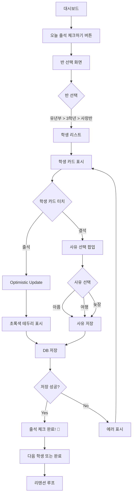
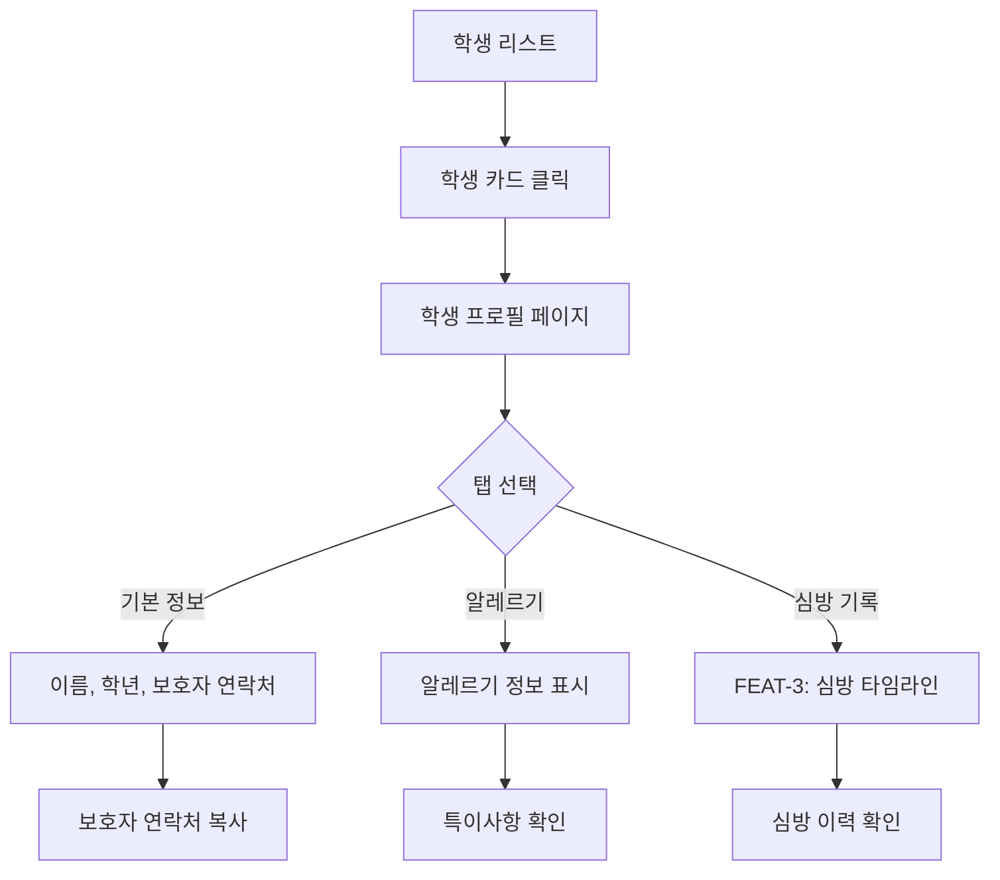
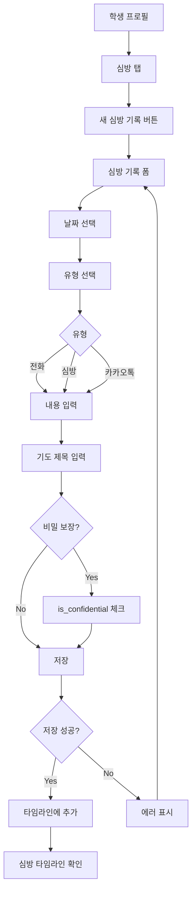
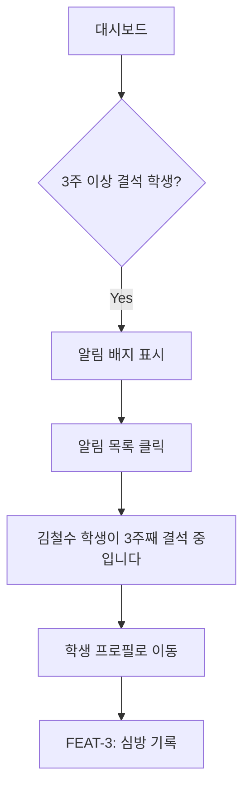
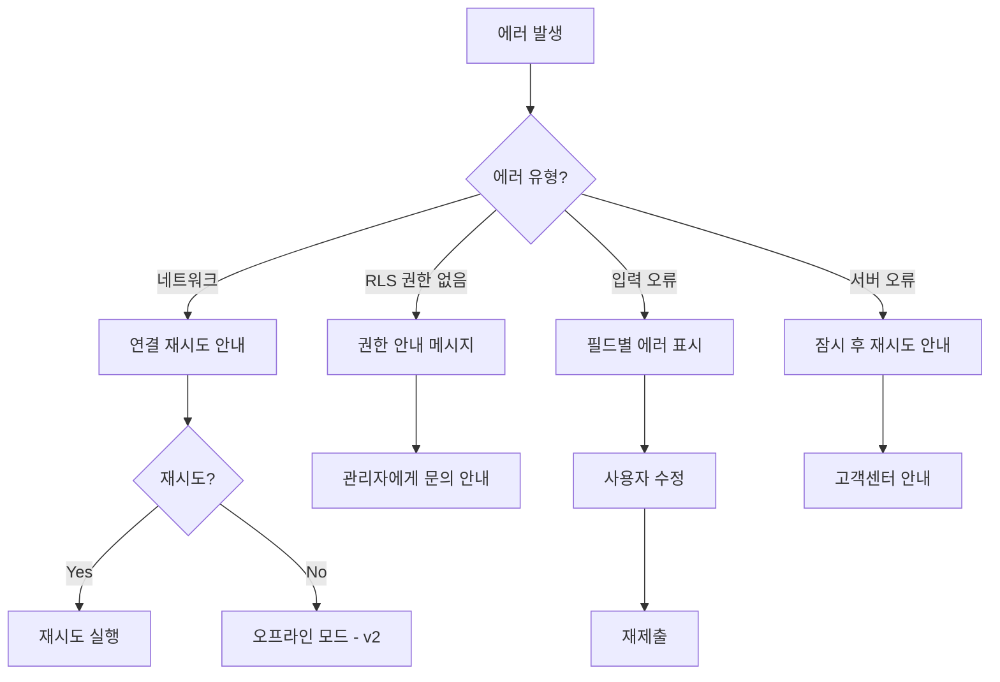

# User Flow (사용자 흐름도)

> Mermaid 플로우차트로 핵심 기능의 주요 여정을 표현합니다.
> 성공/실패 분기를 포함하고, 온보딩→핵심작업→리텐션 루프를 표현합니다.

---

## MVP 캡슐

| # | 항목 | 내용 |
|---|------|------|
| 1 | 목표 | 종이 교적부의 비효율을 해결하고, 학생 이탈 조짐을 조기에 발견하여 목회적 '골든타임'을 확보 |
| 2 | 페르소나 | 바쁜 김교사 (35세, 유년부 담임, 스마트폰 기본 사용 가능) |
| 3 | 핵심 기능 | FEAT-1: 스마트 출석 체크 (모바일에서 터치 한 번으로 출석 처리) |
| 4 | 성공 지표 (노스스타) | 매주 출석 체크를 하는 교사 비율 **80% 이상** |
| 5 | 입력 지표 | 주간 활성 사용자 수 (WAU), 출석 기록 건수, 평균 출석 처리 시간 (3초 이내) |
| 6 | 비기능 요구 | 모바일에서 출석 체크 3초 이내 완료, WCAG 2.1 AA 접근성 준수 |
| 7 | Out-of-scope | 게이미피케이션, 통계 리포트, 학부모 포털, 자동 등반 시스템 (v2로 보류) |
| 8 | Top 리스크 | 교사들의 디지털 기기 익숙도 차이 |
| 9 | 완화/실험 | 극도로 단순한 UI (1~2번 터치로 완료), 온보딩 튜토리얼 (첫 사용 시 3분 가이드) |
| 10 | 다음 단계 | 소규모 부서(고등부) 파일럿 도입, 핵심 기능(출석, 심방) 안정화 |

---

## 1. 전체 사용자 여정 (Overview)



---

## 2. FEAT-0: 온보딩/로그인 플로우



**온보딩 튜토리얼 내용:**
1. "반 선택하기" - 사이드바에서 계층 구조 설명
2. "출석 체크하기" - 학생 카드 터치 방법
3. "심방 기록하기" - 심방 탭 사용법

---

## 3. FEAT-1: 스마트 출석 체크 플로우



**핵심 UX:**
- 학생 카드는 모바일에서 카드 형태로 표시 (테이블 X)
- 터치 한 번으로 출석/결석 처리
- Optimistic Update로 즉각적인 UI 반응
- 완료 시 재미있는 피드백 메시지

---

## 4. FEAT-2: 학생 프로필 조회 플로우



---

## 5. FEAT-3: 심방 기록 플로우



**장기 결석 알림 플로우:**


---

## 6. 리텐션 루프 (습관 형성)

```mermaid
graph TD
    A[출석 체크 완료] --> B["오늘 출석 체크 완료! 🎉"]
    B --> C[진행 상황 저장]
    C --> D[다음 주 리마인더 설정]
    
    %% 리마인더 루프
    E[시간 경과] --> F{주일 오전?}
    F -->|Yes| G[푸시 알림: "오늘 출석 체크하세요"]
    G --> H[앱 재진입]
    H --> A
    
    F -->|No| I[자연 재방문]
    I --> A
    
    %% 성취 루프
    D --> J{4주 연속 출석 체크?}
    J -->|Yes| K[특별 보상: "4주 개근 달성! 🏆"]
    K --> A
    J -->|No| A
```

**리텐션 전략:**
- 매주 주일 오전 푸시 알림 (v2)
- 출석 체크 완료 시 즉각적인 피드백
- 4주 연속 출석 시 배지/보상 (v2)

---

## 7. 에러 처리 플로우



---

## 8. 화면 목록 (Screen Inventory)

| 화면 ID | 화면명 | FEAT | 진입점 | 주요 액션 |
|---------|--------|------|--------|----------|
| S-01 | 시작 화면 | FEAT-0 | 앱 실행 | 로그인/가입 선택 |
| S-02 | 로그인 | FEAT-0 | S-01 | 이메일/비밀번호 로그인 |
| S-03 | 회원가입 | FEAT-0 | S-01 | 계정 생성, 역할 선택 |
| S-04 | 온보딩 튜토리얼 | FEAT-0 | S-03 (첫 사용자) | 3분 가이드 |
| S-05 | 대시보드 | - | S-02, S-04 | 출석 체크, 심방 기록 진입 |
| S-06 | 반 선택 | FEAT-1 | S-05 | 계층 구조에서 반 선택 |
| S-07 | 학생 리스트 | FEAT-1 | S-06 | 학생 카드 표시, 출석 체크 |
| S-08 | 학생 프로필 | FEAT-2 | S-07 | 기본 정보, 알레르기, 심방 기록 |
| S-09 | 심방 기록 폼 | FEAT-3 | S-08 | 심방 내용 입력 |
| S-10 | 심방 타임라인 | FEAT-3 | S-08 | 심방 이력 시간순 표시 |
| S-11 | 알림 목록 | FEAT-3 | S-05 | 장기 결석 알림 확인 |

---

## Decision Log 참조

- **D-FLOW-01**: 출석 체크 - Optimistic Update로 즉각적인 UI 반응
- **D-FLOW-02**: 온보딩 - 첫 사용자에게 3분 튜토리얼 제공
- **D-FLOW-03**: 리텐션 - 주일 오전 푸시 알림 (v2)
- **D-FLOW-04**: 에러 처리 - 사용자 친화적인 메시지 표시
