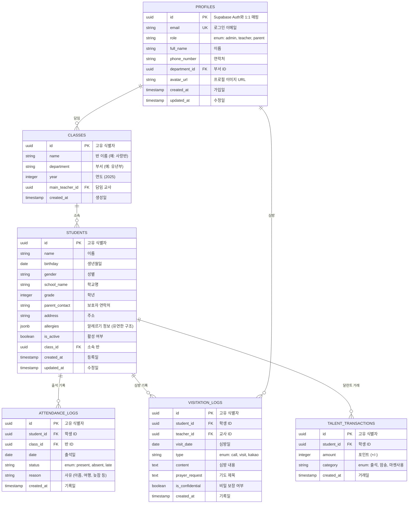
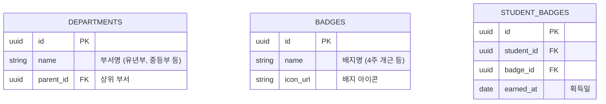

# Database Design (데이터베이스 설계)

> Mermaid ERD로 주요 엔티티와 관계를 표현합니다.
> 각 엔티티에 FEAT 주석을 달아 어떤 기능에서 사용되는지 명시합니다.
> 최소 수집 원칙을 반영하여 불필요한 개인정보는 지양합니다.

---

## MVP 캡슐

| # | 항목 | 내용 |
|---|------|------|
| 1 | 목표 | 종이 교적부의 비효율을 해결하고, 학생 이탈 조짐을 조기에 발견하여 목회적 '골든타임'을 확보 |
| 2 | 페르소나 | 바쁜 김교사 (35세, 유년부 담임, 스마트폰 기본 사용 가능) |
| 3 | 핵심 기능 | FEAT-1: 스마트 출석 체크 (모바일에서 터치 한 번으로 출석 처리) |
| 4 | 성공 지표 (노스스타) | 매주 출석 체크를 하는 교사 비율 **80% 이상** |
| 5 | 입력 지표 | 주간 활성 사용자 수 (WAU), 출석 기록 건수, 평균 출석 처리 시간 (3초 이내) |
| 6 | 비기능 요구 | 모바일에서 출석 체크 3초 이내 완료, WCAG 2.1 AA 접근성 준수 |
| 7 | Out-of-scope | 게이미피케이션, 통계 리포트, 학부모 포털, 자동 등반 시스템 (v2로 보류) |
| 8 | Top 리스크 | 교사들의 디지털 기기 익숙도 차이 |
| 9 | 완화/실험 | 극도로 단순한 UI (1~2번 터치로 완료), 온보딩 튜토리얼 (첫 사용 시 3분 가이드) |
| 10 | 다음 단계 | 소규모 부서(고등부) 파일럿 도입, 핵심 기능(출석, 심방) 안정화 |

---

## 1. ERD (Entity Relationship Diagram)



---

## 2. 엔티티 상세 정의

### 2.1 PROFILES (사용자/교사) - FEAT-0

| 컬럼 | 타입 | 제약조건 | 설명 |
|------|------|----------|------|
| id | UUID | PK, FK → auth.users.id | Supabase Auth와 1:1 매핑 |
| email | VARCHAR(255) | UNIQUE, NOT NULL | 로그인 이메일 |
| role | ENUM | NOT NULL | admin, teacher, parent |
| full_name | VARCHAR(100) | NOT NULL | 이름 |
| phone_number | VARCHAR(20) | NULL | 연락처 |
| department_id | UUID | FK → departments.id | 부서 ID (v2에서 추가) |
| avatar_url | VARCHAR(500) | NULL | 프로필 이미지 URL |
| created_at | TIMESTAMP | NOT NULL, DEFAULT NOW() | 가입일 |
| updated_at | TIMESTAMP | NOT NULL | 최종 수정일 |

**인덱스:**
- `idx_profiles_email` ON email
- `idx_profiles_role` ON role

**RLS 정책:**
- 교사: 자신의 프로필만 조회/수정 가능
- 관리자: 모든 프로필 조회/수정 가능

**최소 수집 원칙 적용:**
- 필수: email, full_name, role
- 선택: phone_number, avatar_url
- 수집 안 함: 주소, 생년월일 (필요 없음)

### 2.2 STUDENTS (학생 정보) - FEAT-1, FEAT-2

| 컬럼 | 타입 | 제약조건 | 설명 |
|------|------|----------|------|
| id | UUID | PK | 고유 식별자 |
| name | VARCHAR(100) | NOT NULL | 이름 |
| birthday | DATE | NULL | 생년월일 |
| gender | VARCHAR(10) | NULL | 성별 |
| school_name | VARCHAR(100) | NULL | 학교명 |
| grade | INTEGER | NOT NULL | 학년 |
| parent_contact | VARCHAR(20) | NOT NULL | 보호자 연락처 |
| address | VARCHAR(200) | NULL | 주소 |
| allergies | JSONB | NULL | 알레르기 정보 (유연한 구조) |
| is_active | BOOLEAN | NOT NULL, DEFAULT true | 활성 여부 |
| class_id | UUID | FK → classes.id, NOT NULL | 소속 반 |
| created_at | TIMESTAMP | NOT NULL, DEFAULT NOW() | 등록일 |
| updated_at | TIMESTAMP | NOT NULL | 수정일 |

**인덱스:**
- `idx_students_class_id` ON class_id
- `idx_students_is_active` ON is_active
- `idx_students_name` ON name (검색 최적화)

**RLS 정책:**
- 교사: 자신이 담당하는 반(`class_id`)의 학생만 조회 가능
- 관리자: 모든 학생 조회 가능

**JSONB 구조 예시 (allergies):**
```json
{
  "food": ["견과류", "우유"],
  "medicine": ["페니실린"],
  "other": "심한 알레르기성 비염"
}
```

### 2.3 CLASSES (반 정보) - FEAT-1

| 컬럼 | 타입 | 제약조건 | 설명 |
|------|------|----------|------|
| id | UUID | PK | 고유 식별자 |
| name | VARCHAR(50) | NOT NULL | 반 이름 (예: 사랑반) |
| department | VARCHAR(50) | NOT NULL | 부서 (예: 유년부) |
| year | INTEGER | NOT NULL | 연도 (2025) |
| main_teacher_id | UUID | FK → profiles.id, NOT NULL | 담임 교사 |
| created_at | TIMESTAMP | NOT NULL, DEFAULT NOW() | 생성일 |

**인덱스:**
- `idx_classes_year` ON year
- `idx_classes_department` ON department
- `idx_classes_main_teacher_id` ON main_teacher_id

**로직:**
- 연도(`year`) 컬럼을 두어 매년 반이 바뀌어도 과거 데이터 보존
- 매년 초 새 반 생성 시 `year`만 변경하여 이력 관리

### 2.4 ATTENDANCE_LOGS (출석 기록) - FEAT-1

| 컬럼 | 타입 | 제약조건 | 설명 |
|------|------|----------|------|
| id | UUID | PK | 고유 식별자 |
| student_id | UUID | FK → students.id, NOT NULL | 학생 ID |
| class_id | UUID | FK → classes.id, NOT NULL | 반 ID |
| date | DATE | NOT NULL | 출석일 |
| status | VARCHAR(20) | NOT NULL | enum: present, absent, late |
| reason | VARCHAR(50) | NULL | 사유 (아픔, 여행, 늦잠 등) |
| created_at | TIMESTAMP | NOT NULL, DEFAULT NOW() | 기록일 |

**제약조건:**
- UNIQUE (`student_id`, `date`) - 한 학생당 하루에 하나의 출석 기록만

**인덱스:**
- `idx_attendance_student_date` ON (student_id, date)
- `idx_attendance_class_date` ON (class_id, date)
- `idx_attendance_date` ON date DESC

**RLS 정책:**
- 교사: 자신이 담당하는 반(`class_id`)의 출석 기록만 조회/생성 가능
- 관리자: 모든 출석 기록 조회 가능

### 2.5 VISITATION_LOGS (심방 기록) - FEAT-3

| 컬럼 | 타입 | 제약조건 | 설명 |
|------|------|----------|------|
| id | UUID | PK | 고유 식별자 |
| student_id | UUID | FK → students.id, NOT NULL | 학생 ID |
| teacher_id | UUID | FK → profiles.id, NOT NULL | 교사 ID |
| visit_date | DATE | NOT NULL | 심방일 |
| type | VARCHAR(20) | NOT NULL | enum: call, visit, kakao |
| content | TEXT | NOT NULL | 심방 내용 |
| prayer_request | TEXT | NULL | 기도 제목 |
| is_confidential | BOOLEAN | NOT NULL, DEFAULT false | 비밀 보장 여부 |
| created_at | TIMESTAMP | NOT NULL, DEFAULT NOW() | 기록일 |

**인덱스:**
- `idx_visitation_student` ON student_id
- `idx_visitation_teacher` ON teacher_id
- `idx_visitation_date` ON visit_date DESC

**RLS 정책:**
- 교사: 자신이 담당하는 반의 심방 기록 조회 가능 (단, `is_confidential=true`는 제외)
- 관리자: 모든 심방 기록 조회 가능 (비밀 포함)

**보안:**
- `is_confidential=true`일 경우 담당 교역자(admin)만 조회 가능하도록 RLS 정책 추가

### 2.6 TALENT_TRANSACTIONS (달란트 장부) - FEAT-4 (v2)

| 컬럼 | 타입 | 제약조건 | 설명 |
|------|------|----------|------|
| id | UUID | PK | 고유 식별자 |
| student_id | UUID | FK → students.id, NOT NULL | 학생 ID |
| amount | INTEGER | NOT NULL | 포인트 (+/-) |
| category | VARCHAR(20) | NOT NULL | enum: 출석, 암송, 마켓사용 |
| created_at | TIMESTAMP | NOT NULL, DEFAULT NOW() | 거래일 |

**인덱스:**
- `idx_talent_student` ON student_id
- `idx_talent_category` ON category
- `idx_talent_date` ON created_at DESC

**계산:**
- 학생별 달란트 잔액은 `SUM(amount)`로 계산 (별도 테이블 불필요)

---

## 3. 관계 정의

| 부모 | 자식 | 관계 | 설명 |
|------|------|------|------|
| PROFILES | CLASSES | 1:N | 한 교사는 여러 반을 담당할 수 있음 (과거 이력 포함) |
| CLASSES | STUDENTS | 1:N | 한 반에는 여러 학생이 소속됨 |
| STUDENTS | ATTENDANCE_LOGS | 1:N | 한 학생은 여러 출석 기록을 가짐 |
| STUDENTS | VISITATION_LOGS | 1:N | 한 학생은 여러 심방 기록을 가짐 |
| PROFILES | VISITATION_LOGS | 1:N | 한 교사는 여러 심방 기록을 작성함 |
| STUDENTS | TALENT_TRANSACTIONS | 1:N | 한 학생은 여러 달란트 거래를 가짐 |

---

## 4. 데이터 생명주기

| 엔티티 | 생성 시점 | 보존 기간 | 삭제/익명화 |
|--------|----------|----------|------------|
| PROFILES | 회원가입 | 탈퇴 후 30일 | Hard delete |
| STUDENTS | 학생 등록 | 졸업 후 1년 | Hard delete |
| CLASSES | 반 생성 | 영구 보존 (이력 관리) | Soft delete (is_active=false) |
| ATTENDANCE_LOGS | 출석 체크 | 졸업 후 1년 | Hard delete |
| VISITATION_LOGS | 심방 기록 | 졸업 후 1년 | Hard delete (비밀 정보 포함) |
| TALENT_TRANSACTIONS | 달란트 거래 | 졸업 후 1년 | Hard delete |

---

## 5. 확장 고려사항

### 5.1 v2에서 추가 예정 엔티티



### 5.2 인덱스 전략

- **읽기 최적화**: 자주 조회되는 컬럼에 인덱스 (student_id, class_id, date)
- **쓰기 고려**: 인덱스 과다 방지 (출석 기록은 자주 생성되므로)
- **복합 인덱스**: 자주 함께 조회되는 컬럼 조합 (student_id, date)

### 5.3 성능 최적화

- **JSONB 활용**: 알레르기 등 가변 정보는 JSONB로 유연하게 처리
- **파티셔닝**: 출석 기록이 많아지면 날짜 기준 파티셔닝 고려 (v2)
- **캐싱**: 자주 조회되는 학생 리스트는 TanStack Query로 캐싱

---

## Decision Log 참조

- **D-DB-01**: 데이터베이스 - Supabase PostgreSQL 선택 (RLS 보안, JSONB 지원)
- **D-DB-02**: 알레르기 정보 - JSONB로 유연한 구조 처리
- **D-DB-03**: 반 정보 - 연도(`year`) 컬럼으로 과거 데이터 보존
- **D-DB-04**: 출석 기록 - UNIQUE 제약조건으로 중복 방지
- **D-DB-05**: 심방 기록 - `is_confidential` 필드로 비밀 정보 보호
