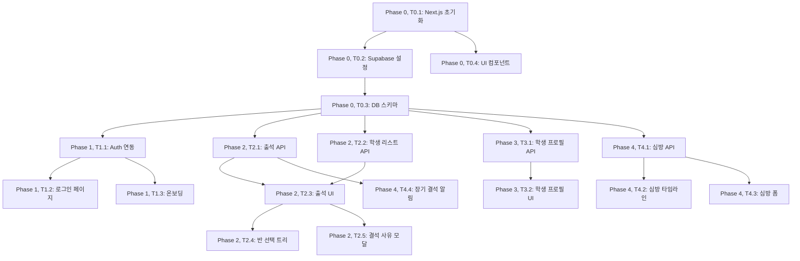

# TASKS: 차세대 주일학교 교적부 웹앱 - AI 개발 파트너용 태스크 목록

## MVP 캡슐

1. 목표: 종이 교적부의 비효율을 해결하고, 학생 이탈 조짐을 조기에 발견하여 목회적 '골든타임'을 확보
2. 페르소나: 바쁜 김교사 (35세, 유년부 담임, 스마트폰 기본 사용 가능)
3. 핵심 기능: FEAT-1: 스마트 출석 체크 (모바일에서 터치 한 번으로 출석 처리)
4. 성공 지표 (노스스타): 매주 출석 체크를 하는 교사 비율 **80% 이상**
5. 입력 지표: 주간 활성 사용자 수 (WAU), 출석 기록 건수, 평균 출석 처리 시간 (3초 이내)
6. 비기능 요구: 모바일에서 출석 체크 3초 이내 완료, WCAG 2.1 AA 접근성 준수
7. Out-of-scope: 게이미피케이션, 통계 리포트, 학부모 포털, 자동 등반 시스템 (v2로 보류)
8. Top 리스크: 교사들의 디지털 기기 익숙도 차이
9. 완화/실험: 극도로 단순한 UI (1~2번 터치로 완료), 온보딩 튜토리얼 (첫 사용 시 3분 가이드)
10. 다음 단계: 소규모 부서(고등부) 파일럿 도입, 핵심 기능(출석, 심방) 안정화

---

## 마일스톤 개요

| 마일스톤 | 설명 | 주요 기능 | Phase |
|----------|------|----------|-------|
| M0 | 프로젝트 셋업 | Next.js 15 + Supabase 초기 설정 | Phase 0 |
| M1 | FEAT-0 공통 흐름 | 온보딩/로그인 | Phase 1 |
| M2 | FEAT-1 핵심기능 | 스마트 출석 체크 | Phase 2 |
| M3 | FEAT-2 학생 프로필 | 학생 정보 조회 | Phase 3 |
| M4 | FEAT-3 심방 기록 | 심방 타임라인 | Phase 4 |

---

## M0: 프로젝트 셋업

### [x] Phase 0, T0.1: Next.js 15 프로젝트 초기화

**담당**: frontend-specialist

**작업 내용**:
- Next.js 15 (App Router) 프로젝트 생성
- TypeScript 설정
- Tailwind CSS 설정
- Shadcn/UI 설치 및 초기 설정
- 기본 디렉토리 구조 생성

**산출물**:
- `package.json`
- `tsconfig.json`
- `tailwind.config.ts`
- `app/layout.tsx`
- `app/page.tsx`
- `components.json` (Shadcn/UI 설정)
- `lib/utils.ts` (cn 함수)

**완료 조건**:
- [x] `npm run dev` 실행 시 정상 작동
- [x] TypeScript 타입 체크 통과
- [x] Tailwind CSS 스타일 적용 확인

---

### [x] Phase 0, T0.2: Supabase 프로젝트 설정

**담당**: database-specialist

**작업 내용**:
- Supabase 프로젝트 생성 (사용자가 직접 생성 필요)
- 환경 변수 설정 (`.env.local`)
- Supabase 클라이언트 초기화
- 타입 생성 스크립트 설정

**산출물**:
- `.env.local` (커밋 제외, 사용자가 생성)
- `lib/supabase/client.ts` ✅
- `lib/supabase/server.ts` ✅
- `lib/supabase/test-connection.ts` ✅
- `types/supabase.ts` (기본 타입 정의 완료) ✅
- `scripts/check-supabase.ts` (연결 테스트 스크립트) ✅
- `package.json` (스크립트 추가) ✅

**완료 조건**:
- [x] Supabase 연결 테스트 스크립트 생성 (`npm run check:supabase`)
- [x] 환경 변수 로드 확인 스크립트 작동
- [x] 타입 자동 생성 스크립트 설정 (`npm run gen:types`)

---

### [x] Phase 0, T0.3: 데이터베이스 스키마 생성

**담당**: database-specialist

**작업 내용**:
- Supabase에서 테이블 생성 (Database Design 문서 참조)
  - `profiles` (사용자/교사)
  - `students` (학생 정보)
  - `classes` (반 정보)
  - `attendance_logs` (출석 기록)
  - `visitation_logs` (심방 기록)
  - `talent_transactions` (달란트 장부, v2)
- RLS (Row Level Security) 정책 설정
- 인덱스 생성

**산출물**:
- `supabase/migrations/001_initial_schema.sql` ✅
- `docs/supabase-rls-policies.md` (RLS 정책 문서) ✅
- `scripts/verify-schema.ts` (스키마 검증 스크립트) ✅

**완료 조건**:
- [x] 모든 테이블 정의 완료 (6개 테이블)
- [x] RLS 정책 정의 완료 (7개 정책)
- [x] 인덱스 정의 완료 (15개 인덱스)
- [x] 스키마 검증 스크립트 생성 (`npm run verify:schema`)

---

### [x] Phase 0, T0.4: 기본 UI 컴포넌트 설정

**담당**: frontend-specialist

**작업 내용**:
- Shadcn/UI 기본 컴포넌트 설치 (Button, Card, Input 등)
- 디자인 시스템 적용 (Design System 문서 참조)
- Pretendard 폰트 설정
- 기본 레이아웃 컴포넌트 생성

**산출물**:
- `components/ui/button.tsx` ✅
- `components/ui/card.tsx` ✅
- `components/ui/input.tsx` ✅
- `components/layout/Container.tsx` ✅
- `components/layout/PageHeader.tsx` ✅
- `app/globals.css` (Pretendard 폰트, 디자인 시스템 색상 변수) ✅
- `app/components-test/page.tsx` (컴포넌트 테스트 페이지) ✅

**완료 조건**:
- [x] Shadcn/UI 컴포넌트 정상 작동 (Button, Card, Input)
- [x] Pretendard 폰트 적용 확인
- [x] 디자인 시스템 색상 팔레트 적용 확인
- [x] 기본 레이아웃 컴포넌트 생성 (Container, PageHeader)

---

## M1: FEAT-0 공통 흐름 (온보딩/로그인)

### [x] Phase 1, T1.1: Supabase Auth 연동 RED→GREEN

**담당**: backend-specialist

**Git Worktree 설정**:
```bash
# 1. Worktree 생성
git worktree add ../project-phase1-auth -b phase/1-auth
cd ../project-phase1-auth

# 2. 작업 완료 후 병합 (사용자 승인 필요)
# git checkout main
# git merge phase/1-auth
# git worktree remove ../project-phase1-auth
```

**TDD 사이클**:

1. **RED**: 테스트 작성 (실패 확인) ✅
   ```bash
   # 테스트 파일: __tests__/auth.test.tsx
   npm run test __tests__/auth.test.tsx  # Expected: FAILED
   ```

2. **GREEN**: 최소 구현 (테스트 통과) ✅
   ```bash
   # 구현 파일: lib/supabase/auth.ts, hooks/useAuth.ts
   npm run test __tests__/auth.test.tsx  # Expected: PASSED ✅
   ```

3. **REFACTOR**: 리팩토링 (테스트 유지) ✅
   - 코드 정리
   - 에러 처리 개선
   - act() 경고 수정
   - 테스트 계속 통과 확인

**산출물**:
- `__tests__/auth.test.tsx` (테스트) ✅
- `lib/supabase/auth.ts` (서버/클라이언트 헬퍼 함수) ✅
- `hooks/useAuth.ts` (커스텀 훅) ✅

**인수 조건**:
- [x] 테스트 먼저 작성됨 (RED 확인)
- [x] 모든 테스트 통과 (GREEN - 6/6 테스트 통과)
- [x] 로그인/로그아웃 기능 정상 작동
- [x] 세션 유지 확인 (onAuthStateChange 구현)
- [x] 타입 체크 통과
- [x] 빌드 성공

---

### [x] Phase 1, T1.2: 로그인 페이지 구현 RED→GREEN

**담당**: frontend-specialist

**Git Worktree 설정**:
```bash
git worktree add ../project-phase1-login -b phase/1-login
cd ../project-phase1-login
```

**의존성**: T1.1 (Supabase Auth) - **Mock 사용으로 독립 개발 가능**

**Mock 설정**:
```typescript
// src/mocks/authMock.ts
export const mockAuth = {
  signIn: vi.fn().mockResolvedValue({ data: { user: { id: '1' } } }),
  signOut: vi.fn().mockResolvedValue({}),
};
```

**TDD 사이클**:

1. **RED**: 테스트 작성
   ```bash
   # 테스트 파일: src/__tests__/login.test.tsx
   npm run test src/__tests__/login.test.tsx  # Expected: FAILED
   ```

2. **GREEN**: 최소 구현
   ```bash
   # 구현 파일: src/app/(auth)/login/page.tsx
   npm run test src/__tests__/login.test.tsx  # Expected: PASSED
   ```

3. **REFACTOR**: 리팩토링

**산출물**:
- `__tests__/login.test.tsx` (테스트) ✅
- `app/(auth)/login/page.tsx` (구현) ✅
- `components/auth/LoginForm.tsx` ✅

**인수 조건**:
- [x] 테스트 먼저 작성됨 (RED 확인)
- [x] 모든 테스트 통과 (GREEN - 6/6 테스트 통과)
- [x] 이메일/비밀번호 로그인 작동
- [x] 에러 메시지 표시 확인
- [x] 로그인 성공 시 대시보드로 리다이렉트
- [x] 타입 체크 통과
- [x] 빌드 성공

---

### [x] Phase 1, T1.3: 온보딩 튜토리얼 구현 RED→GREEN

**담당**: frontend-specialist

**Git Worktree 설정**:
```bash
git worktree add ../project-phase1-onboarding -b phase/1-onboarding
cd ../project-phase1-onboarding
```

**TDD 사이클**:

1. **RED**: 테스트 작성 ✅
   ```bash
   # 테스트 파일: __tests__/onboarding.test.tsx
   npm run test __tests__/onboarding.test.tsx  # Expected: FAILED
   ```

2. **GREEN**: 최소 구현 ✅
   ```bash
   # 구현 파일: components/onboarding/OnboardingTutorial.tsx
   npm run test __tests__/onboarding.test.tsx  # Expected: PASSED ✅
   ```

3. **REFACTOR**: 리팩토링 ✅
   - 코드 정리
   - 타입 안정성 개선

**산출물**:
- `__tests__/onboarding.test.tsx` (테스트) ✅
- `components/onboarding/OnboardingTutorial.tsx` (구현) ✅
- `app/(auth)/onboarding/page.tsx` ✅

**인수 조건**:
- [x] 테스트 먼저 작성됨 (RED 확인)
- [x] 모든 테스트 통과 (GREEN - 9/9 테스트 통과)
- [x] 첫 사용자에게만 튜토리얼 표시 (localStorage 확인)
- [x] 3단계 튜토리얼 (반 선택, 출석 체크, 심방 기록)
- [x] 완료 시 localStorage에 저장
- [x] 건너뛰기 기능
- [x] 이전/다음 네비게이션
- [x] 타입 체크 통과
- [x] 빌드 성공

---

## M2: FEAT-1 핵심기능 (스마트 출석 체크)

### [x] Phase 2, T2.1: 출석 기록 API 구현 RED→GREEN

**담당**: backend-specialist

**Git Worktree 설정**:
```bash
git worktree add ../project-phase2-attendance-api -b phase/2-attendance-api
cd ../project-phase2-attendance-api
```

**TDD 사이클**:

1. **RED**: 테스트 작성 ✅
   ```bash
   # 테스트 파일: __tests__/attendance-api.test.ts
   npm run test __tests__/attendance-api.test.ts  # Expected: FAILED
   ```

2. **GREEN**: 최소 구현 ✅
   ```bash
   # 구현 파일: lib/supabase/attendance.ts
   npm run test __tests__/attendance-api.test.ts  # Expected: PASSED ✅
   ```

3. **REFACTOR**: 리팩토링 ✅
   - 코드 정리
   - 타입 안정성 개선

**산출물**:
- `__tests__/attendance-api.test.ts` (테스트) ✅
- `lib/supabase/attendance.ts` (구현) ✅
- `types/attendance.ts` (타입 정의) ✅

**인수 조건**:
- [x] 테스트 먼저 작성됨 (RED 확인)
- [x] 모든 테스트 통과 (GREEN - 9/9 테스트 통과)
- [x] 출석 기록 생성/조회 기능
- [x] 출석 기록 업데이트/삭제 기능
- [x] upsert 기능 (생성 또는 업데이트)
- [x] UNIQUE 제약조건 확인 (student_id, date)
- [x] 타입 체크 통과
- [x] 빌드 성공

---

### [x] Phase 2, T2.2: 학생 리스트 조회 API 구현 RED→GREEN

**담당**: backend-specialist

**Git Worktree 설정**:
```bash
git worktree add ../project-phase2-student-list -b phase/2-student-list
cd ../project-phase2-student-list
```

**의존성**: T0.3 (데이터베이스 스키마)

**TDD 사이클**:

1. **RED**: 테스트 작성 ✅
   ```bash
   # 테스트 파일: __tests__/student-list.test.ts
   npm run test __tests__/student-list.test.ts  # Expected: FAILED
   ```

2. **GREEN**: 최소 구현 ✅
   ```bash
   # 구현 파일: lib/supabase/students.ts
   npm run test __tests__/student-list.test.ts  # Expected: PASSED ✅
   ```

3. **REFACTOR**: 리팩토링 ✅
   - 타입 안정성 개선
   - TanStack Query 훅 추가

**산출물**:
- `__tests__/student-list.test.ts` (테스트) ✅
- `lib/supabase/students.ts` (구현) ✅
- `types/student.ts` (타입 정의) ✅
- `hooks/useStudents.ts` (TanStack Query 훅) ✅

**인수 조건**:
- [x] 테스트 먼저 작성됨 (RED 확인)
- [x] 모든 테스트 통과 (GREEN - 6/6 테스트 통과)
- [x] 반(class_id)별 학생 리스트 조회
- [x] 활성 상태 필터링 (is_active)
- [x] 이름 검색 기능
- [x] 단일 학생 조회 (getStudentById)
- [x] 모든 활성 학생 조회
- [x] TanStack Query 캐싱 적용 (useStudents 훅)
- [x] 타입 체크 통과
- [x] 빌드 성공

---

### [x] Phase 2, T2.3: 출석 체크 UI 컴포넌트 구현 RED→GREEN

**담당**: frontend-specialist

**Git Worktree 설정**:
```bash
git worktree add ../project-phase2-attendance-ui -b phase/2-attendance-ui
cd ../project-phase2-attendance-ui
```

**의존성**: T2.1 (출석 기록 API), T2.2 (학생 리스트 API)

**TDD 사이클**:

1. **RED**: 테스트 작성 ✅
   ```bash
   # 테스트 파일: __tests__/AttendanceCard.test.tsx
   npm run test __tests__/AttendanceCard.test.tsx  # Expected: FAILED
   ```

2. **GREEN**: 최소 구현 ✅
   ```bash
   # 구현 파일: components/attendance/AttendanceCard.tsx
   npm run test __tests__/AttendanceCard.test.tsx  # Expected: PASSED ✅
   ```

3. **REFACTOR**: 리팩토링 ✅
   - Optimistic Update 구현
   - 타입 안정성 개선

**산출물**:
- `__tests__/AttendanceCard.test.tsx` (테스트) ✅
- `components/attendance/AttendanceCard.tsx` (구현) ✅
- `components/attendance/StudentList.tsx` ✅
- `app/(dashboard)/attendance/page.tsx` ✅
- `lib/providers/QueryProvider.tsx` (TanStack Query Provider) ✅

**인수 조건**:
- [x] 테스트 먼저 작성됨 (RED 확인)
- [x] 모든 테스트 통과 (GREEN - 7/7 테스트 통과)
- [x] 학생 카드 터치로 출석/결석 처리
- [x] Optimistic Update 적용 (즉각적인 UI 반응)
- [x] 모바일 최적화 (카드 형태, min-h-[48px])
- [x] 출석 완료 시 초록색 테두리 표시
- [x] 결석 시 빨간색 테두리 표시
- [x] 지각 시 앰버색 테두리 표시
- [x] TanStack Query Provider 설정
- [x] 타입 체크 통과
- [x] 빌드 성공

---

### [x] Phase 2, T2.4: 반 선택 트리 뷰 구현 RED→GREEN

**담당**: frontend-specialist

**Git Worktree 설정**:
```bash
git worktree add ../project-phase2-class-tree -b phase/2-class-tree
cd ../project-phase2-class-tree
```

**TDD 사이클**:

1. **RED**: 테스트 작성 ✅
   ```bash
   # 테스트 파일: __tests__/ClassTree.test.tsx
   npm run test __tests__/ClassTree.test.tsx  # Expected: FAILED
   ```

2. **GREEN**: 최소 구현 ✅
   ```bash
   # 구현 파일: components/class/ClassTree.tsx
   npm run test __tests__/ClassTree.test.tsx  # Expected: PASSED ✅
   ```

3. **REFACTOR**: 리팩토링 ✅
   - 타입 안정성 개선
   - 출석 체크 페이지 통합

**산출물**:
- `__tests__/ClassTree.test.tsx` (테스트) ✅
- `components/class/ClassTree.tsx` (구현) ✅
- `components/class/ClassSidebar.tsx` (사이드바) ✅
- `lib/supabase/classes.ts` (반 API) ✅
- `hooks/useClasses.ts` (TanStack Query 훅) ✅
- `types/class.ts` (타입 정의) ✅

**인수 조건**:
- [x] 테스트 먼저 작성됨 (RED 확인)
- [x] 모든 테스트 통과 (GREEN - 6/6 테스트 통과)
- [x] 계층 구조 표시 (부서 > 반)
- [x] Drill-down 방식으로 필터링 (부서 확장/축소)
- [x] 모바일에서 접을 수 있는 사이드바
- [x] 반 선택 시 출석 체크 페이지 연동
- [x] 선택된 반 하이라이트
- [x] 타입 체크 통과
- [x] 빌드 성공

---

### [x] Phase 2, T2.5: 결석 사유 선택 모달 구현 RED→GREEN

**담당**: frontend-specialist

**Git Worktree 설정**:
```bash
git worktree add ../project-phase2-absence-reason -b phase/2-absence-reason
cd ../project-phase2-absence-reason
```

**의존성**: T2.3 (출석 체크 UI)

**TDD 사이클**:

1. **RED**: 테스트 작성 ✅
   ```bash
   # 테스트 파일: __tests__/AbsenceReasonModal.test.tsx
   npm run test __tests__/AbsenceReasonModal.test.tsx  # Expected: FAILED
   ```

2. **GREEN**: 최소 구현 ✅
   ```bash
   # 구현 파일: components/attendance/AbsenceReasonModal.tsx
   npm run test __tests__/AbsenceReasonModal.test.tsx  # Expected: PASSED ✅
   ```

3. **REFACTOR**: 리팩토링 ✅
   - AttendanceCard에 모달 통합
   - 타입 안정성 개선

**산출물**:
- `__tests__/AbsenceReasonModal.test.tsx` (테스트) ✅
- `components/attendance/AbsenceReasonModal.tsx` (구현) ✅
- `components/ui/dialog.tsx` (Dialog 컴포넌트) ✅

**인수 조건**:
- [x] 테스트 먼저 작성됨 (RED 확인)
- [x] 모든 테스트 통과 (GREEN - 8/8 테스트 통과)
- [x] 결석 선택 시 모달 표시
- [x] 사유 선택 (아픔, 여행, 늦잠, 기타)
- [x] 커스텀 사유 입력 기능
- [x] 선택한 사유가 출석 기록에 저장
- [x] AttendanceCard에 모달 통합
- [x] 타입 체크 통과
- [x] 빌드 성공

---

### [x] Phase 2, T2.6: 출석 통계 컴포넌트 구현 RED→GREEN

**담당**: frontend-specialist

**Git Worktree 설정**:
```bash
git worktree add ../project-phase2-attendance-stats -b phase/2-attendance-stats
cd ../project-phase2-attendance-stats
```

**의존성**: T2.3 (출석 체크 UI), T2.4 (반 선택 트리 뷰)

**TDD 사이클**:

1. **RED**: 테스트 작성 ✅
   ```bash
   # 테스트 파일: __tests__/AttendanceStats.test.tsx
   npm run test __tests__/AttendanceStats.test.tsx  # Expected: FAILED
   ```

2. **GREEN**: 최소 구현 ✅
   ```bash
   # 구현 파일: components/attendance/AttendanceStats.tsx
   npm run test __tests__/AttendanceStats.test.tsx  # Expected: PASSED ✅
   ```

3. **REFACTOR**: 리팩토링 ✅
   - 출석 체크 페이지에 통합
   - 타입 안정성 개선

**산출물**:
- `__tests__/AttendanceStats.test.tsx` (테스트) ✅
- `components/attendance/AttendanceStats.tsx` (구현) ✅
- `lib/supabase/attendance.ts` (getAttendanceStats 함수 추가) ✅
- `types/attendance.ts` (AttendanceStats 타입 추가) ✅

**인수 조건**:
- [x] 테스트 먼저 작성됨 (RED 확인)
- [x] 모든 테스트 통과 (GREEN - 7/7 테스트 통과)
- [x] 전체 학생 수 표시
- [x] 출석 수 표시
- [x] 결석 수 표시
- [x] 지각 수 표시
- [x] 출석률 계산 및 표시 (출석 + 지각 / 전체)
- [x] 출석률 프로그레스 바 표시
- [x] 출석 체크 페이지에 통합
- [x] 타입 체크 통과
- [x] 빌드 성공

---

## M3: FEAT-2 학생 프로필

### [x] Phase 3, T3.1: 학생 프로필 조회 API 구현 RED→GREEN

**담당**: backend-specialist

**Git Worktree 설정**:
```bash
git worktree add ../project-phase3-student-profile-api -b phase/3-student-profile-api
cd ../project-phase3-student-profile-api
```

**TDD 사이클**:

1. **RED**: 테스트 작성 ✅
   ```bash
   # 테스트 파일: __tests__/student-profile.test.ts
   npm run test __tests__/student-profile.test.ts  # Expected: FAILED
   ```

2. **GREEN**: 최소 구현 ✅
   ```bash
   # 구현 파일: lib/supabase/students.ts (확장)
   npm run test __tests__/student-profile.test.ts  # Expected: PASSED ✅
   ```

3. **REFACTOR**: 리팩토링 ✅
   - 타입 안정성 개선
   - 에러 처리 개선

**산출물**:
- `__tests__/student-profile.test.ts` (테스트) ✅
- `lib/supabase/students.ts` (getStudentProfile 함수 추가) ✅

**인수 조건**:
- [x] 테스트 먼저 작성됨 (RED 확인)
- [x] 모든 테스트 통과 (GREEN - 6/6 테스트 통과)
- [x] 학생 기본 정보 조회
- [x] 알레르기 정보 (JSONB) 조회
- [x] RLS 정책으로 권한 확인
- [x] 에러 처리 (학생 없음, 권한 없음)
- [x] 타입 체크 통과
- [x] 빌드 성공

---

### [x] Phase 3, T3.2: 학생 프로필 페이지 구현 RED→GREEN

**담당**: frontend-specialist

**Git Worktree 설정**:
```bash
git worktree add ../project-phase3-student-profile-ui -b phase/3-student-profile-ui
cd ../project-phase3-student-profile-ui
```

**의존성**: T3.1 (학생 프로필 API) - **Mock 사용으로 독립 개발 가능**

**TDD 사이클**:

1. **RED**: 테스트 작성 ✅
   ```bash
   # 테스트 파일: __tests__/StudentProfile.test.tsx
   npm run test __tests__/StudentProfile.test.tsx  # Expected: FAILED
   ```

2. **GREEN**: 최소 구현 ✅
   ```bash
   # 구현 파일: app/(dashboard)/students/[id]/page.tsx
   npm run test __tests__/StudentProfile.test.tsx  # Expected: PASSED ✅
   ```

3. **REFACTOR**: 리팩토링 ✅
   - 컴포넌트 구조 개선
   - 타입 안정성 개선

**산출물**:
- `__tests__/StudentProfile.test.tsx` (테스트) ✅
- `app/(dashboard)/students/[id]/page.tsx` (구현) ✅
- `components/student/StudentProfile.tsx` (구현) ✅
- `hooks/useStudentProfile.ts` (TanStack Query 훅) ✅

**인수 조건**:
- [x] 테스트 먼저 작성됨 (RED 확인)
- [x] 모든 테스트 통과 (GREEN - 7/7 테스트 통과)
- [x] 기본 정보 표시 (이름, 학년, 보호자 연락처, 생년월일, 성별, 학교명, 주소)
- [x] 알레르기 정보 표시 (JSONB 데이터 파싱 및 표시)
- [x] 로딩 상태 처리
- [x] 에러 상태 처리 (학생 없음)
- [x] 타입 체크 통과
- [x] 빌드 성공
- [ ] 심방 탭 (FEAT-3 연동 - 향후 구현)

---

## M4: FEAT-3 심방 기록

### [x] Phase 4, T4.1: 심방 기록 API 구현 RED→GREEN

**담당**: backend-specialist

**Git Worktree 설정**:
```bash
git worktree add ../project-phase4-visitation-api -b phase/4-visitation-api
cd ../project-phase4-visitation-api
```

**TDD 사이클**:

1. **RED**: 테스트 작성 ✅
   ```bash
   # 테스트 파일: __tests__/visitation-api.test.ts
   npm run test __tests__/visitation-api.test.ts  # Expected: FAILED
   ```

2. **GREEN**: 최소 구현 ✅
   ```bash
   # 구현 파일: lib/supabase/visitation.ts
   npm run test __tests__/visitation-api.test.ts  # Expected: PASSED ✅
   ```

3. **REFACTOR**: 리팩토링 ✅
   - 타입 안정성 개선
   - 에러 처리 개선

**산출물**:
- `__tests__/visitation-api.test.ts` (테스트) ✅
- `lib/supabase/visitation.ts` (구현) ✅
- `types/visitation.ts` (타입 정의) ✅

**인수 조건**:
- [x] 테스트 먼저 작성됨 (RED 확인)
- [x] 모든 테스트 통과 (GREEN - 11/11 테스트 통과)
- [x] 심방 기록 생성/조회 기능
- [x] 심방 기록 업데이트/삭제 기능
- [x] 필터링 기능 (student_id, teacher_id, 날짜 범위, type, is_confidential)
- [x] 비밀 보장 필드 (`is_confidential`) 처리
- [x] 타입 체크 통과
- [x] 빌드 성공
- [x] RLS 정책으로 권한 확인 (Supabase에서 처리)

---

### [x] Phase 4, T4.2: 심방 타임라인 UI 구현 RED→GREEN

**담당**: frontend-specialist

**Git Worktree 설정**:
```bash
git worktree add ../project-phase4-visitation-timeline -b phase/4-visitation-timeline
cd ../project-phase4-visitation-timeline
```

**의존성**: T4.1 (심방 기록 API) - **Mock 사용으로 독립 개발 가능**

**TDD 사이클**:

1. **RED**: 테스트 작성 ✅
   ```bash
   # 테스트 파일: __tests__/VisitationTimeline.test.tsx
   npm run test __tests__/VisitationTimeline.test.tsx  # Expected: FAILED
   ```

2. **GREEN**: 최소 구현 ✅
   ```bash
   # 구현 파일: components/visitation/VisitationTimeline.tsx
   npm run test __tests__/VisitationTimeline.test.tsx  # Expected: PASSED ✅
   ```

3. **REFACTOR**: 리팩토링 ✅
   - 학생 프로필 페이지에 통합
   - 타입 안정성 개선

**산출물**:
- `__tests__/VisitationTimeline.test.tsx` (테스트) ✅
- `components/visitation/VisitationTimeline.tsx` (구현) ✅
- `hooks/useVisitations.ts` (TanStack Query 훅) ✅
- `components/student/StudentProfile.tsx` (심방 타임라인 통합) ✅

**인수 조건**:
- [x] 테스트 먼저 작성됨 (RED 확인)
- [x] 모든 테스트 통과 (GREEN - 7/7 테스트 통과)
- [x] 시간순 타임라인 표시 (날짜 내림차순)
- [x] 심방 유형 아이콘 표시 (전화/심방/카카오톡)
- [x] 비밀 보장 표시 (Lock 아이콘 및 "비밀" 라벨)
- [x] 기도 제목 표시 (있는 경우)
- [x] 로딩 상태 처리
- [x] 빈 상태 처리
- [x] 학생 프로필 페이지에 통합
- [x] 타입 체크 통과
- [x] 빌드 성공

---

### [x] Phase 4, T4.3: 심방 기록 폼 구현 RED→GREEN

**담당**: frontend-specialist

**Git Worktree 설정**:
```bash
git worktree add ../project-phase4-visitation-form -b phase/4-visitation-form
cd ../project-phase4-visitation-form
```

**의존성**: T4.1 (심방 기록 API) - **Mock 사용으로 독립 개발 가능**

**TDD 사이클**:

1. **RED**: 테스트 작성
   ```bash
   # 테스트 파일: src/__tests__/VisitationForm.test.tsx
   npm run test src/__tests__/VisitationForm.test.tsx  # Expected: FAILED
   ```

2. **GREEN**: 최소 구현
   ```bash
   # 구현 파일: src/components/visitation/VisitationForm.tsx
   npm run test src/__tests__/VisitationForm.test.tsx  # Expected: PASSED
   ```

3. **REFACTOR**: 리팩토링

**산출물**:
- `src/__tests__/VisitationForm.test.tsx` (테스트)
- `src/components/visitation/VisitationForm.tsx` (구현)

**인수 조건**:
- [x] 테스트 먼저 작성됨 (RED 확인)
- [x] 모든 테스트 통과 (GREEN)
- [x] 날짜 선택
- [x] 유형 선택 (전화/심방/카카오톡)
- [x] 내용 입력
- [x] 기도 제목 입력
- [x] 비밀 보장 체크박스
- [x] 폼 검증
- [x] 에러 처리
- [x] 로딩 상태 처리
- [x] 학생 프로필 페이지에 통합
- [x] 타입 체크 통과
- [x] 빌드 성공

---

### [x] Phase 4, T4.4: 장기 결석 알림 기능 구현 RED→GREEN

**담당**: backend-specialist

**Git Worktree 설정**:
```bash
git worktree add ../project-phase4-absence-alert -b phase/4-absence-alert
cd ../project-phase4-absence-alert
```

**의존성**: T2.1 (출석 기록 API)

**TDD 사이클**:

1. **RED**: 테스트 작성
   ```bash
   # 테스트 파일: src/__tests__/absence-alert.test.ts
   npm run test src/__tests__/absence-alert.test.ts  # Expected: FAILED
   ```

2. **GREEN**: 최소 구현
   ```bash
   # 구현 파일: src/lib/supabase/absence-alert.ts
   npm run test src/__tests__/absence-alert.test.ts  # Expected: PASSED
   ```

3. **REFACTOR**: 리팩토링

**산출물**:
- `__tests__/absence-alert.test.ts` (테스트) ✅
- `lib/supabase/absence-alert.ts` (구현) ✅
- `types/absence-alert.ts` (타입 정의) ✅

**인수 조건**:
- [x] 테스트 먼저 작성됨 (RED 확인)
- [x] 모든 테스트 통과 (GREEN)
- [x] 3주 이상 결석 학생 자동 추출
- [x] 담당 교사에게 알림 표시 (UI 구현 완료)
- [x] 대시보드에 알림 배지 표시 (UI 구현 완료)

### [x] Phase 4, T4.5: 장기 결석 알림 UI 구현 (추가)

**담당**: frontend-specialist

**작업 내용**:
- 장기 결석 알림 배지 컴포넌트 구현
- 장기 결석 알림 목록 컴포넌트 구현
- TanStack Query 훅 구현 (useAbsenceAlerts)
- 대시보드 페이지 생성 및 통합

**산출물**:
- `hooks/useAbsenceAlerts.ts` (TanStack Query 훅) ✅
- `components/absence/AbsenceAlertBadge.tsx` (배지 컴포넌트) ✅
- `components/absence/AbsenceAlertList.tsx` (목록 컴포넌트) ✅
- `app/(dashboard)/dashboard/page.tsx` (대시보드 페이지) ✅
- `__tests__/AbsenceAlertBadge.test.tsx` (테스트) ✅
- `__tests__/AbsenceAlertList.test.tsx` (테스트) ✅

**인수 조건**:
- [x] 테스트 먼저 작성됨 (RED 확인)
- [x] 모든 테스트 통과 (GREEN - 12/12 테스트 통과)
- [x] 장기 결석 학생 수 배지 표시
- [x] 장기 결석 학생 목록 표시
- [x] 대시보드에 알림 배지 통합
- [x] 학생 클릭 시 프로필 페이지로 이동

---

## 의존성 그래프



---

## 병렬 실행 가능 태스크

| Phase | 태스크 | 병렬 가능 여부 | 비고 |
|-------|--------|---------------|------|
| Phase 0 | T0.1, T0.2 | ✅ | 독립적 |
| Phase 0 | T0.3, T0.4 | ✅ | 독립적 |
| Phase 1 | T1.2, T1.3 | ✅ | T1.1 완료 후, Mock 사용 |
| Phase 2 | T2.1, T2.2 | ✅ | 독립적 |
| Phase 2 | T2.3, T2.4, T2.5 | ✅ | T2.1, T2.2 완료 후, Mock 사용 |
| Phase 3 | T3.1, T3.2 | ❌ | 순차 실행 |
| Phase 4 | T4.1, T4.4 | ✅ | 독립적 |
| Phase 4 | T4.2, T4.3 | ✅ | T4.1 완료 후, Mock 사용 |

---

## 태스크 실행 방법

각 태스크를 실행하려면 다음과 같이 입력하세요:

### 방법 1: 태스크 ID로 실행
"T2.1 진행해줘"

### 방법 2: 역할 + 작업 설명
"backend-specialist 역할로 출석 API 구현해줘"

### 방법 3: 상세 지시
"Phase 2의 T2.1을 진행해줘.
 Git Worktree를 생성하고 TDD 사이클을 따라서 구현해줘."

---

## 참조 문서

- **PRD**: `docs/planning/01-prd.md` - 제품 요구사항
- **TRD**: `docs/planning/02-trd.md` - 기술 요구사항
- **User Flow**: `docs/planning/03-user-flow.md` - 사용자 흐름
- **Database Design**: `docs/planning/04-database-design.md` - DB 설계
- **Design System**: `docs/planning/05-design-system.md` - 디자인 시스템
- **Coding Convention**: `docs/planning/07-coding-convention.md` - 코딩 컨벤션
